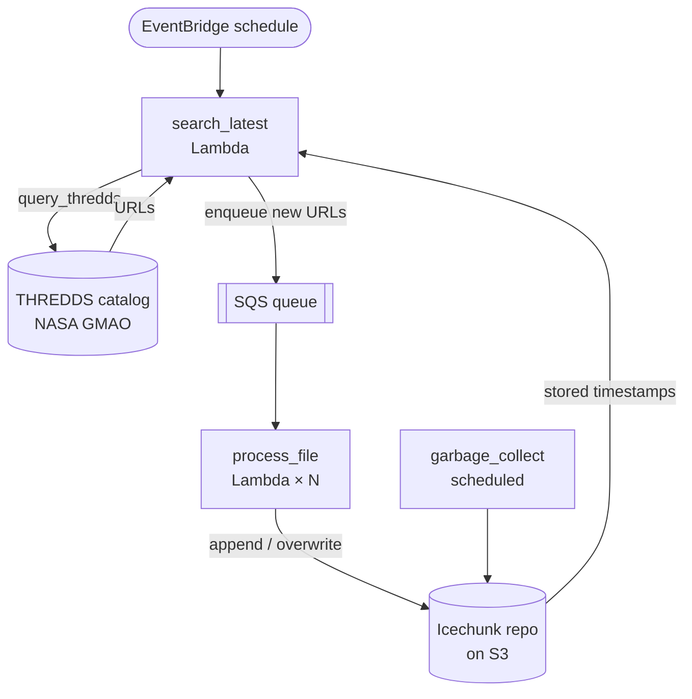

# GEOS-CF Pipeline Design

## Purpose
This pipeline builds and maintains a virtual, analysis-ready view of NASA's GEOS-CF (Goddard Earth Observing System Composition Forecasting) dataset. Rather than copying GEOS-CF data into a new physical store, it uses [VirtualiZarr](https://github.com/zarr-developers/VirtualiZarr) to record references to the source NetCDF files and commits those references into an [Icechunk](https://icechunk.io) repository on S3. Consumers can then open the entire archive as a single Zarr dataset and read directly from the original files.

## Where the data comes from
GEOS-CF is produced by NASA's Global Modeling and Assimilation Office (GMAO) and published as hourly NetCDF4 (`.nc4`) files. The authoritative distribution is the GMAO THREDDS Data Server at `https://ds.nccs.nasa.gov/thredds/`. Files are organized by collection and partitioned into `Y<year>/M<month>/D<day>/` directories, with timestamps embedded in each filename (for example `GEOS.cf.ana.aqc_tavg_1hr_glo_L1440x721_slv.20250804_0930z.nc4`).

There are no push notification, manifest, or change feed for new files, GMAO simply publishes them into the catalog as they become available. To keep the Icechunk repository current, the pipeline must poll the THREDDS catalog, compare what is published against what is already committed, and ingest the difference.

## Why we query THREDDS
THREDDS exposes an XML catalog tree that mirrors the on-disk layout. Discovery is essentially a catalog walk: load the day's `catalog.xml`, list the datasets it contains, filter by filename pattern, and resolve each match to a URL that points at the underlying file on THREDDS.

A few constraints shape the design:
- **Cadence is irregular.** New hourly files may arrive in clusters or with delays of several hours. A scheduled poll is the simplest reliable trigger.
- **Day boundaries matter.** Files for "today" may be partially published while "yesterday" is typically complete, so discovery checks the previous day first and falls back to today.
- **Idempotency is required.** The same file may be visible across multiple polls, so the pipeline reconciles candidates against the timestamps already stored in Icechunk and only enqueues new work.
- **Catalog traversal can be expensive.** Glob-style patterns (with `**`) prune subtrees that cannot match, avoiding a full walk of years of archive directories.

## Components

### `query_thredds` (shared library)
A small, dependency-light helper that wraps [siphon](https://unidata.github.io/siphon/) to traverse THREDDS catalogs, and ensure simple filtering.
- `load_catalog(url)` — fetches and parses a catalog with retry/backoff.
- `recurse_catalog(catalog, pattern)` — yields matching dataset HTTP URLs using a `**`-aware glob matcher that prunes non-matching subcatalogs.

Kept independent of any Lambda or Icechunk code so it can be unit-tested and reused.

### `search_latest` (Lambda)
The discovery and enqueue step. Triggered on a schedule (EventBridge) or on demand.
1. Loads the day catalog for yesterday (falling back to today) using `query_thredds`.
2. Parses the UTC timestamp out of each filename.
3. Reads the current set of stored timestamps from the Icechunk repository (`Processor.search_state`).
4. Filters candidates down to those not yet committed.
5. Enqueues the eligible URLs to SQS as a single batched message in chronological order.

It performs no data processing — only "what should be processed next."

### `process_file` (Lambda)
The ingestion step. Triggered by SQS messages produced by `search_latest` (or by external SNS publishers wired through the same queue).
- Accepts a single `url` or a batch of `urls`; URLs may be full THREDDS HTTPs or relative keys.
- Builds a virtual dataset for the files via `virtualizarr.open_virtual_mfdataset` against the THREDDS HTTP store.
- Commits to Icechunk with `append_dim="time"` by default, or with `region="auto"` when the message sets `"overwrite": true`.
- Retries commits under `ConflictError`, since concurrent appends to the same branch can race.

Concurrency on the SQS event source is capped (`MAX_CONCURRENCY`, default 25) to bound contention on the Icechunk branch.

### `initialize` (Lambda)
Bootstraps the Icechunk repository once, at stack creation. Opens or creates the repo, configures manifest splitting along `time` at one-year boundaries, and if the repo is empty writes a scaffolded "empty" dataset spanning the configured date range. The scaffold seeds dimensions, coordinates, variables, and chunk metadata so subsequent `process_file` runs only need to fill chunks.

### `garbage_collect` (Lambda, optional)
Runs on a schedule (`GARBAGE_COLLECTION_FREQUENCY` days) inside a VPC-attached compute environment. Expires snapshots older than the cutoff and deletes the now-unreferenced objects from S3 to keep storage bounded.

## End-to-end flow

1. `initialize` runs once and scaffolds the repository.
2. `search_latest` runs on schedule, walks the latest day's THREDDS catalog via `query_thredds`, and enqueues new file URLs.
3. `process_file` consumes the queue, builds virtual references, and appends to Icechunk.
4. `garbage_collect` periodically reclaims storage.

## Reliability and operations
- **Idempotency.** `search_latest` reconciles against the live Icechunk timestamp set on every run, so repeated polls do not re-enqueue committed files. `process_file` supports an explicit `overwrite` mode for controlled reprocessing.
- **Backpressure.** Discovery emits a single batched SQS message per run; SQS event-source concurrency caps the number of parallel `process_file` invocations.
- **Commit safety.** `process_file` retries Icechunk commits with exponential backoff using `ConflictDetector` rebases, tolerating concurrent appends on the `main` branch.
- **Failure isolation.** Discovery and ingestion are separate Lambdas with separate IAM, logs, and failure modes; a broken catalog response cannot corrupt the repository, and an ingestion failure does not block future discovery.
- **Observability.** All Lambdas use `aws_lambda_powertools` Logger/Tracer for structured logs and X-Ray traces.
